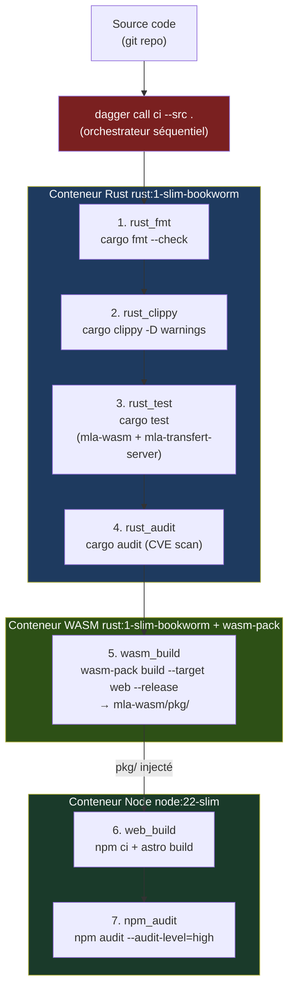

# CI Dagger — MLA-Share

Pipeline de sécurité du projet MLA-Share, implémenté avec [Dagger](https://dagger.io) (SDK Python).

---

## Architecture



---

## Étapes du pipeline

| # | Fonction | Conteneur | Commande | Objectif |
|---|----------|-----------|----------|---------|
| 1 | `rust_fmt` | `rust:1-slim-bookworm` | `cargo fmt --all -- --check` | Style de code Rust uniforme |
| 2 | `rust_clippy` | `rust:1-slim-bookworm` | `cargo clippy --workspace -D warnings` | Détection de bugs et code non-idiomatique |
| 3 | `rust_test` | `rust:1-slim-bookworm` | `cargo test -p mla-wasm -p mla-transfert-server` | Tests unitaires et d'intégration Rust |
| 4 | `rust_audit` | `rust:1-slim-bookworm` | `cargo audit --file audit.toml` | Scan CVE des dépendances Rust (RustSec) |
| 5 | `wasm_build` | `rust:1-slim-bookworm` + wasm-pack | `wasm-pack build --target web --release` | Compilation WASM + génération des types TypeScript |
| 6 | `web_build` | `node:22-slim` | `npm ci && npm run build` | Build Astro (WASM pkg injecté depuis l'étape 5) |
| 7 | `npm_audit` | `node:22-slim` | `npm audit --audit-level=high` | Scan CVE des dépendances Node.js (npm advisory) |

Le pipeline est **séquentiel et fail-fast** : si une étape échoue, les suivantes ne s'exécutent pas.

### Caches Dagger

| Volume | Contenu | Bénéfice |
|--------|---------|---------|
| `cargo-registry` | Index crates.io | Évite le re-téléchargement des crates |
| `cargo-git` | Dépendances git | Idem pour les dépendances git |
| `cargo-target` | Artefacts de compilation | Compilation incrémentale entre les runs |
| `npm-cache` | Cache npm | Accélère `npm ci` |

---

## Utilisation

### Prérequis

```bash
# Installer Dagger CLI
curl -L https://dl.dagger.io/dagger/install.sh | sh

# Vérifier
dagger version
```

### Lancer le pipeline complet

```bash
# Depuis la racine du projet
dagger call ci --src .
```

### Lancer une étape individuelle

```bash
# Vérification du formatage Rust
dagger call rust-fmt --src .

# Linter Rust
dagger call rust-clippy --src .

# Tests Rust
dagger call rust-test --src .

# Scan CVE Rust
dagger call rust-audit --src .

# Build WASM
dagger call wasm-build --src .

# Build frontend
dagger call web-build --src .

# Scan CVE Node
dagger call npm-audit --src .
```

### Développement du pipeline CI lui-même

```bash
cd ci/

# Installer les dépendances Python (SDK Dagger)
uv sync

# Lancer via dagger (recharge automatiquement le module)
dagger call ci --src ..
```

---

## Structure des fichiers

```
ci/
├── README.md            ← ce fichier
├── src/
│   └── mla/
│       ├── __init__.py
│       └── main.py      ← pipeline Dagger (fonctions @function)
├── sdk/                 ← SDK Dagger Python (généré, ignoré par git)
├── pyproject.toml
└── .gitignore
dagger.json              ← configuration du module Dagger (racine du projet)
audit.toml               ← exceptions CVE cargo-audit (RUSTSEC ignorées justifiées)
```

---

## Gestion des CVE ignorées

Le fichier `audit.toml` à la racine liste les CVE Rust intentionnellement ignorées avec leur justification.

```toml
# Exemple : ignorer une advisory upstream non patchable
[advisories]
ignore = ["RUSTSEC-2025-XXXX"]
```

Toute exception doit être documentée et réévaluée à chaque mise à jour des dépendances.

---

## Évidences de sécurité

Chaque exécution de `dagger call ci --src .` produit un rapport structuré :

```
[PASS] fmt
[PASS] clippy
[PASS] test
[PASS] rust-audit
      Crates scanned: 142 | Vulnerabilities found: 0
[PASS] wasm-build
[PASS] web-build
[PASS] npm-audit
      found 0 vulnerabilities
```

Ces sorties constituent les **évidences de sécurité** du build — à conserver pour les audits NIS2 et les dossiers de conformité.
